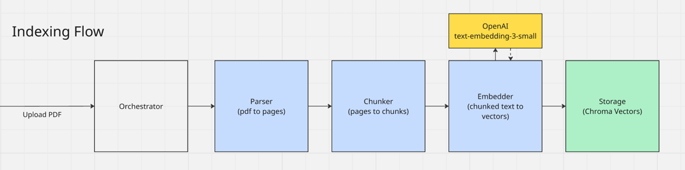
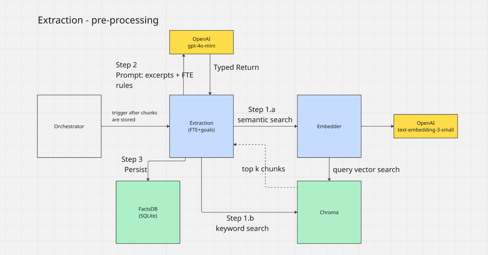
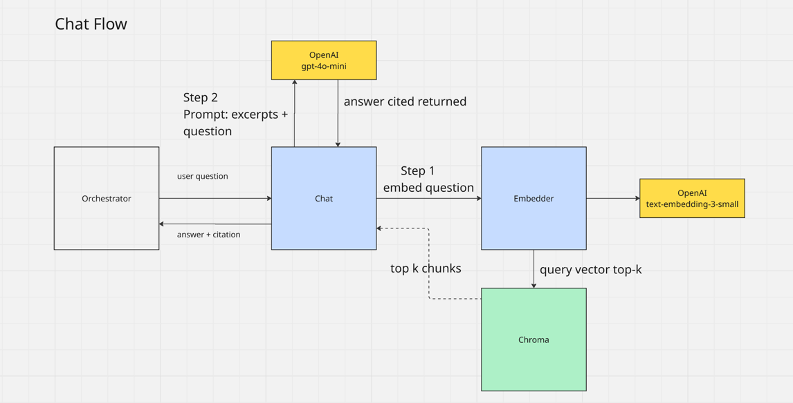
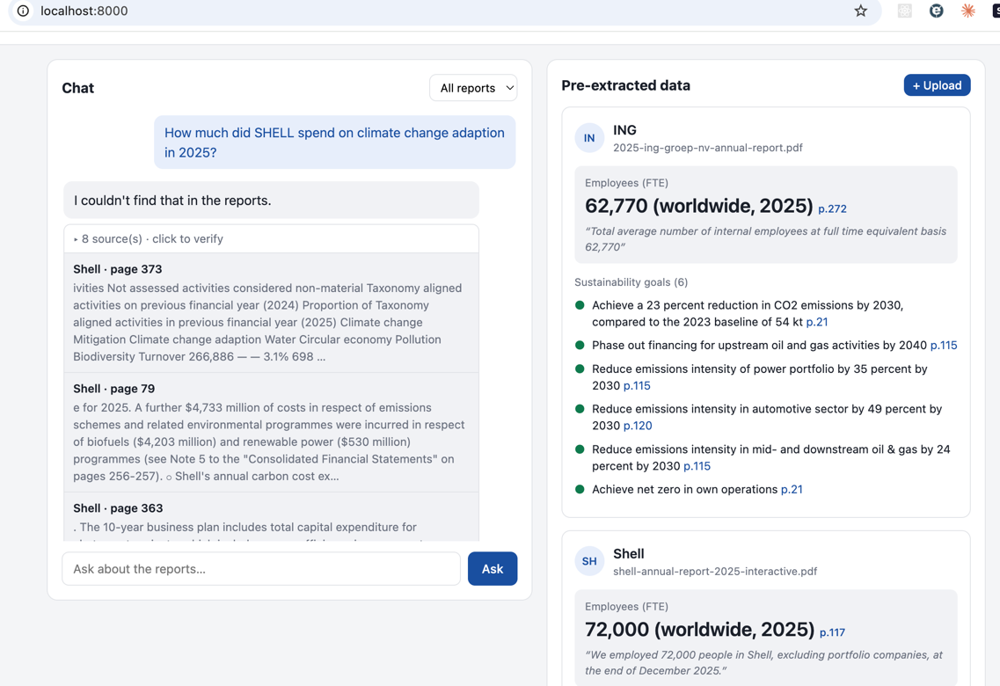
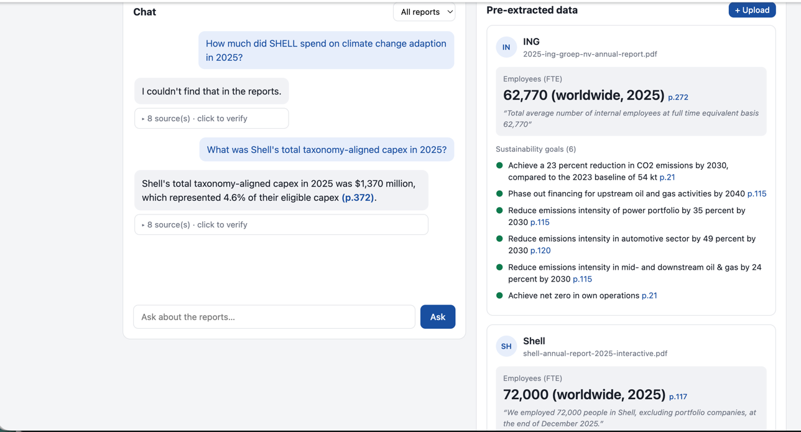
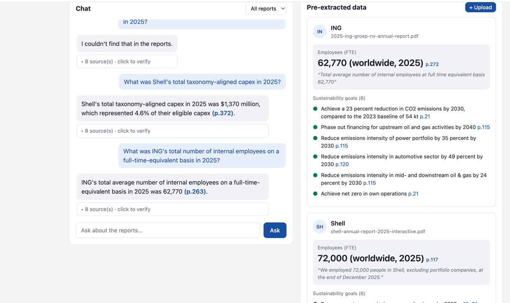

# Annual report RAG

A small web app for asking questions about company annual reports. User uploads a
report PDF, it gets indexed, and can then chat with it. Answers quote the
source text and cite the page they came from, so user can check them. While a
report is being indexed, the app also pulls out two things up front and shows
them in a side panel: the employee headcount (FTE) and the company's
sustainability targets.

## System Design

### Indexing 



#### Components

1. Orchestrator 

   1. The single entry point that runs the pipeline end to end.
   2. make re-uploads idempotent (wipe a file's old chunks first)
   3. run synchronously for now

2. Parser

   1. Numbers (FTE, spend) are in tables. Need two parsing - text and tables.
   2. Tables are flattened as cell | cell to keep labels with values, and the page number is kept for citations. 
   3. Digital PDFs only, no OCR.

3. Chunker

   1. Splits pages into ~1000-char overlapping windows.
   2. Overlap so a number split across a boundary survives intact
   3. tag every chunk with company, source, and page for citation and filtering

4. Embedder

   1. Use OpenAI with same model and function for indexing and querying 
   2. Embeddings are computed and passed in explicitly 
   3. calls to OpenAO are batched for cost purposes.

5. Storage

   1. on-disk so the index survives restarts.
   2. store the embedding, the verbatim text (for real quotes), and metadata (for citations + per-company filtering) together

6. OpenAI (Embedding model)

   1. use a cheap tier 
   2. user provides key before running.

### Extraction with Pre-processing



1. Extraction (FTE + goals)

   1. Runs after storage and reads back from the vector store.
   2. Reuse the retriever — feed the LLM only relevant excerpts, never whole pages.
   3. Hybrid retrieval: semantic search + keyword search (keyword catches the numeric FTE tables that embed badly).
   4. Every value comes with a verbatim quote + page.

2. Embedder

   1. Embeds the query

3. Chroma

   1. Same store from indexing, queried two ways.
   2. Vector similarity for the semantic route; a direct keyword/regex scan for the FTE route.

4. OpenAI
   
   1. Cheap model for the extraction step.
   2. Gets only the retrieved excerpts, ground answers on them.

5. FactsDB (SQLite)

   1. Separate store from the vectors to highlight FTE and goals.
   2. One row per report, upsert so re-ingest overwrites.
   3. FTE in flat columns, goals as JSON.


### Chat flow



### Results






## How this was built

I designed the system first, then used an AI coding agent to implement it.

The architecture, component breakdown, and the key design decisions are mine —
captured in the diagrams above. Decisions like parsing tables and prose separately, the hybrid
semantic + keyword retrieval for the FTE figure, sharing one embedder across all
flows, and grounding every answer with page citations were specified up front.

I handed those diagrams and decisions to the agent, which wrote the bulk of the
implementation. I reviewed, corrected, and validated the output against the
design.

This README, below this section, was largely drafted by the agent and edited by me.


## Running it

You need Python 3.12 and an OpenAI API key.

```bash
cp .env.example .env     # open .env and paste your OPENAI_API_KEY
./run.sh                 # builds the venv, installs deps, starts the server
```

Then open http://localhost:8000. The first run installs dependencies, so give it
a minute. If `python3.12` isn't your default, point the script at it with
`PYTHON=python3.x ./run.sh`.

The app ships empty. Click "+ Upload", give the report a company name, pick a
PDF, and wait while it indexes (a 300-page report takes about 40 seconds and
costs a cent or two in API calls). After that it answers questions and the
dashboard fills in.

## How it works

Indexing a PDF runs four steps:

1. Parse the PDF page by page. PyMuPDF handles the prose; pdfplumber handles
   tables. Both matter, because the numbers you actually want (spend, headcount)
   usually live in tables, and a text-only parser turns those into a soup of
   loose digits.
2. Split each page into overlapping ~1000-character chunks, keeping the page
   number on each one.
3. Embed every chunk with OpenAI and store it in ChromaDB.
4. Run the pre-extraction pass: retrieve the chunks about headcount and
   sustainability, ask the model to pull out structured values with a supporting
   quote and page, and save them to SQLite.

Asking a question runs the same thing in reverse: embed the question, pull the
nearest chunks out of ChromaDB, hand them to the model, and have it answer using
only those chunks with the page numbers attached.

Both stores live on disk under `data/`, so an index survives a restart. Nothing
is re-ingested on boot.

## Project layout

```
app/
  main.py          FastAPI routes; also serves the frontend
  config.py        settings, read from .env
  parser.py        PDF -> page text (PyMuPDF + pdfplumber)
  chunker.py       page text -> overlapping chunks
  embeddings.py    text -> vectors (OpenAI)
  vector_store.py  ChromaDB wrapper (persistent)
  retriever.py     embed a query, return nearest chunks
  extraction.py    pre-extract FTE + sustainability goals
  facts_store.py   SQLite store for the extracted facts
  chat.py          retrieve + answer with citations
  ingest.py        ties the indexing steps together
  llm.py           shared OpenAI client
  static/          index.html, styles.css, app.js
data/              vector store + sqlite (gitignored, rebuilt on ingest)
reports/           uploaded PDFs (gitignored)
```

## A few decisions worth knowing

The retriever is reused for two jobs: answering questions and doing the
up-front extraction. The extraction step doesn't dump whole pages at the model,
it retrieves the relevant passages first. Cheaper and more accurate, and it
means there's one retrieval path to reason about instead of two.

Extraction runs at `temperature=0`. A single value like the FTE count comes back
the same every time. The list of sustainability goals still varies in length
between runs, which is why every value is stored with its quote and page: if you
doubt a number, you can go read the source.

Answers are told to refuse rather than guess. Ask something the reports don't
cover and you get "I couldn't find that in the reports" instead of a confident
invention. That refusal is the whole point of grounding it.

## What it doesn't do

It reads digital PDFs, not scanned ones. A scanned report would need OCR, which
isn't wired in. Uploads are processed synchronously, so the browser sits on a
spinner for the length of the indexing job rather than showing progress. And the
answer is only as good as retrieval: if the relevant passage doesn't make the
top results, the model won't see it.
